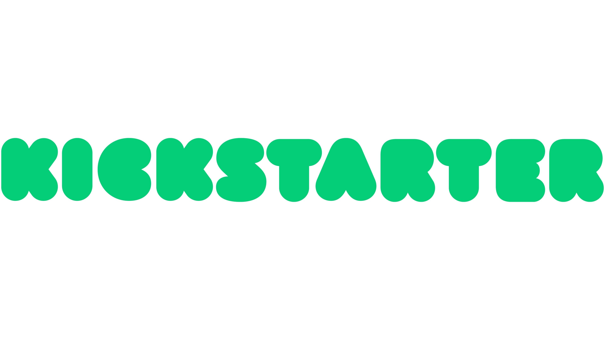

#  Analysis of Kickstarter Website Data (Board Games)
This repository analyzes Kickstarter data to identify key success factors for board game campaigns. It provides insights and recommendations to help creators optimize their crowdfunding strategy.        

           

## Project Overview  
In this project, we were assigned to analyse data from the Kickstarter website to understand the crowdfunding process and identify key factors that contribute to a successful campaign. Our goal is to provide valuable insights and actionable recommendations for someone who is planning to launch a Kickstarter campaign specifically for a board game.  

## Data  
Source Data  
• Website link: (Kickstarter web link)  
• Raw data: (The Data we were given)  
• Profiled data: (The Data we cleaned using PowerBI)  
• Cleaned data: (The Data we cleaned using Python)  

## Data Acquisition  
The data was web scrapped from the Kickstarter website (the link is given in the above section).  
 
## Data Dictionary  
| Column Name         | Description                                                       | Data Type    |  
|---------------------|-------------------------------------------------------------------|--------------|  
| `Project_id`        | A unique identifier for each project.                             | Integer      |  
| `Category`          | The category under which the project was launched (e.g., “Games”, "Technology", "Art"). | Text      |  
| `Subcategory`       | A more specific classification within the main `category`(eg, “Board & Card Games”, “Video Games”)                             | Text     |  
| `City`        | The geographic location of the project creator or where the project is based.          | Text     |  
| `State`        | The geographic location of the project creator or where the project is based.          | Text     |  
| `Status`            | The status of the funds received (e.g., "successful", "failed", “live”).   | Text  |  
| `Goal`              | The funding goal the project aims to raise in USD.                             | Whole Number    |  
| `pledged`           | The total amount of money pledged by backers in USD.              | Whole Number        |  
| `funded percentage` | The percentage of the funding goal that the project have received                          | Percentage     |  
| `backers`           | The total number of backers (Sponsors) who funded for the project.                      | Whole Number     |  
| `Date`       | The date and time when the project was launched.                  | Date    |  
| `Levels`            | Different tiers or levels of pledge amounts set by the project creator.                         | Whole Number     |  
| `Reward Levels` | The rewards or perks that players receive at each `level` | Text      |  
| `Updates` | Regular posts or emails to keep backers informed about progress, milestones, or challenges | Whole Number        |  
| `Duration`        | The duration of the project campaign in days                           | Whole Number      |  
| `Total Reward` | Sum of the rewards or perks that players receive at each `level` | Text      |  

## Data Preprocessing  
The data was first profiled and cleaned in PowerBI, here is a step by step guide for the cleaning:  
1. Filtered board games from the whole data, because our task was to analyse the board games only.  
2. The location column had the state and city both together, that column was split into two different columns, state and City/Country.  
3. Removed the duplicate rows.  
4. The subcategory column had the same type of board games just with two different names, we created a custom column renaming both categories to “Board Games”. Then replaced it with the original one.  
5. The Date column had date and time both in it, we just need the date in it, so we changed the column data type from date and time to date.  
6. Changed the types of columns: Funded Percentage, from float to percentage; Duration, from float to whole number.  
7. We copy and pasted the table from PowerBI to excel to extract the data, and then saved it as a CSV file.  

After we were done with most of the cleaning part in PowerBI, we couldn’t clean the column Reward Levels in it, so we used Python to add another column.  
1. We first imported two libraries pandas and re.  
2. We read the file using pandas.  
3. We created a column “Total Reward” where the values were the sum of reward levels using the library re.  

## Quantitative Analysis  
What is the mean (total) pledge that projects get? (Not per backer.)
The total pledged amount to the projects in Board games is approximately 7 million dollars ($7,177,078)
And the mean is approximately 13k dollars($13,002).

b. Create a histogram that shows the distribution for the number of backers.
What does it tell you?
It is clearly highlighted that most projects receive a low number of backers, while a few attract a significantly higher amount of support (outliers). This suggests an uneven distribution of success, where a small number of projects dominate in terms of backer engagement, the number of backers reaches upto 1000 in some projects.

c. What is the success rate of projects?
55% of the projects were successful.

d. Does the success rate differ across US states?
Yes, States with 100% success rates are: Arizona (AR), Tennessee (TN), Alabama (AL), District of Columbia (DC), Kansas(KS). 
And the bottom three states with the lowest success rates (not failed) are Missouri (MO), Florida (FL), South Carolina (SC), the success rate for these states are between 25% and 30%.

e. What are the differences between projects that succeed and ones that fail?
1. The projects that were succeeded had more number of backers, whereas the projects that failed had a small number backers or didn't have any backers to start with.
2. Number of updates that were given to backers does have an affect on the success rate but we have to be careful about it, the projects that received the most funds were the ones that had not so many updates like upto 100 nor the ones that had too less like 10 or 15, but the most funded projects had the number of updates between 35 to 55.
3. The more interactions or comments a project had, the more funds it received.
   
Answer the main challenge: what actions can someone who is about to start a
Kickstarter campaign take as a result of your analysis and charts?
1. Choose the best location with the highest success rate.
2. When you are done with your project, Keep the duration for collecting the funds between 30 to 60 days.
3. Keep the backers up to dated but not too much.
4. Advertise your project to recieve more views and comments on it so the backers can feel that if they fund this project it would be successful.

## Qualitative Analysis
1. Choose the best location with the highest success rate.
2. When you are done with your project, Keep the duration for collecting the funds between 30 to 60 days.
3. Keep the backers up to dated but not too much.
4. Advertise your project to recieve more views and comments on it so the backers can feel that if they fund this project it would be successful.

